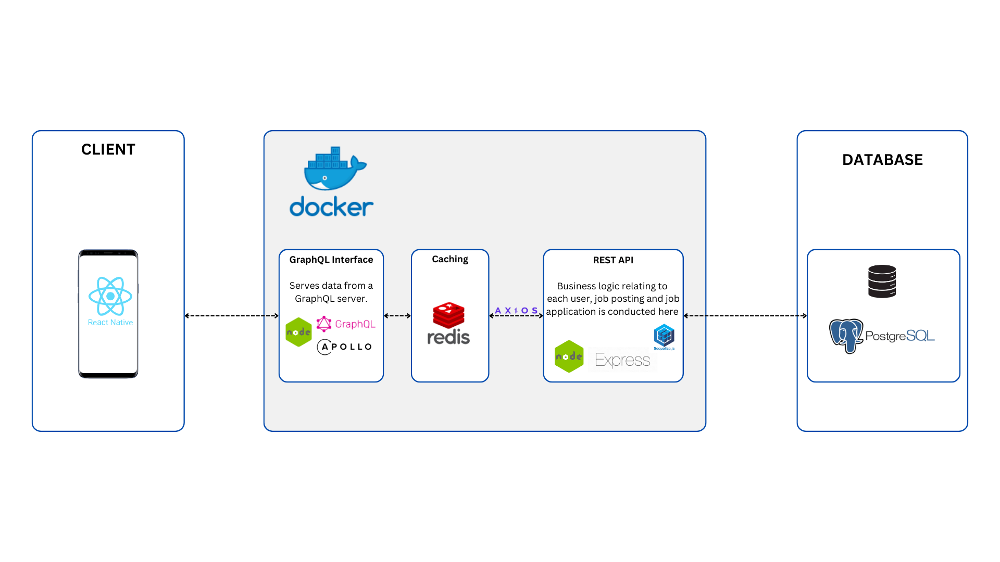
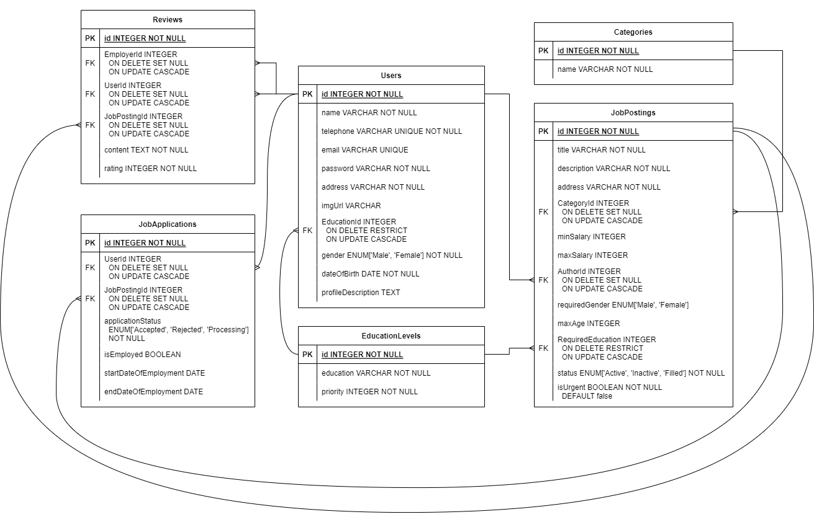
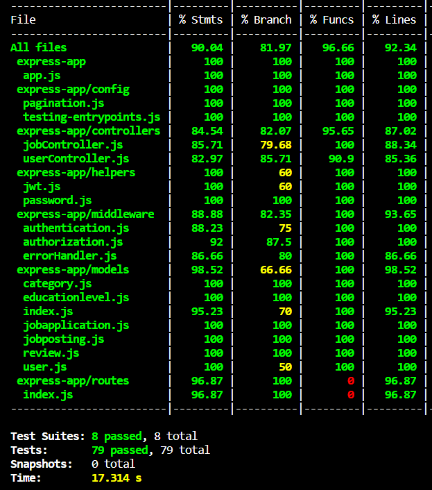

# LokerRoom - Server

Lo·ker - short for *lowongan kerja*, the word is Indonesian colloquialism for "job opening". With that in mind, LokerRoom aims to be the next job platform for blue-collar and informal economy workers throughout Indonesia - a space for anybody to contract out work, without going through any middleman.

This project aims to fulfill two of the 17 Sustainability & Development Goals set by the UN: [No Poverty](https://indonesia.un.org/en/sdgs/1/progress) and [Decent Work and Economic Growth](https://indonesia.un.org/en/sdgs/8/progress)

LokerRoom is a group project between [Arbi M. Ihsan](https://github.com/arbiihsan) (team lead and front-end engineer), [Fairis Nabil](https://github.com/Nacho7S) (front-end engineer) and [Valerie Yauw](https://github.com/ValYauw) (back-end engineer).

**Front-end Repository**: [Link](https://github.com/arbiihsan/LokerRoom-client)

## Application Demo

## Technical Overview

### Tech Stack

 - PostgreSQL Database
 - Express REST API
 - ORM Sequelize
 - GraphQL Server
 - Redis Cache
 - Docker Containers

### Database Schema

### Results of Integration Tests

79 unit tests have been run successfully, achieving an average coverage of **90%**.

## How to Run

This repository is composed of two services - the REST API (`express-app` directory) and the GraphQL server (`graphql` directory). 

To create, migrate, and seed the database in a development and testing environment, go to the `express-app` directory, then run `bash dbsetup-sequelize.sh`. [Requires sequelize-cli]

To run the server, open the directory of each service, setup the `.env` file for each directory, and then run the command `npm run dev`.

The branch `deployment` is provided for ready shipping to production. In this branch, Dockerfiles have been provided for easier setup.